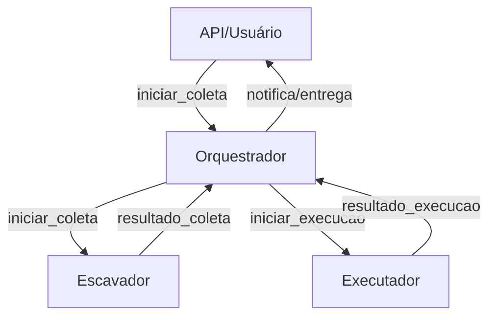

# Orquestrador Core ORÁCULO

Este serviço é responsável por orquestrar a comunicação entre escavadores e executadores, utilizando FastAPI para API/admin, Celery para orquestração assíncrona, RabbitMQ/Redis para mensageria, Prometheus para métricas e ELK para logs.

## Estrutura Inicial
- `main.py`: FastAPI com health check e métricas Prometheus
- `worker.py`: Celery app e exemplo de task
- `requirements.txt`: dependências principais

## Padrão de Mensagens

Todas as mensagens trocadas entre orquestrador, escavadores e executadores seguem o padrão JSON:
- `correlation_id`: string (ID único para rastreamento)
- `tipo_evento`: string (ex: iniciar_coleta, resultado_coleta, iniciar_execucao, resultado_execucao)
- `payload`: objeto (conteúdo do evento)
- `timestamp`: string ISO8601

Exemplo:
```json
{
  "correlation_id": "abc123",
  "tipo_evento": "iniciar_coleta",
  "payload": {
    "fonte": "youtube",
    "parametros": {"canal": "canal_exemplo", "periodo": "2025-10"}
  },
  "timestamp": "2025-10-14T12:00:00Z"
}
```

O schema completo está em `mensagem_schema.json`.

## Fluxo de Orquestração

1. **iniciar_coleta**: O orquestrador publica uma mensagem para o escavador iniciar a coleta de dados.
2. **resultado_coleta**: O escavador publica o resultado da coleta em uma fila de resultados.
3. **iniciar_execucao**: O orquestrador consome o resultado da coleta e publica uma mensagem para o executador processar os dados.
4. **resultado_execucao**: O executador publica o resultado final, que é consumido pelo orquestrador para agregação, armazenamento e notificação.



Cada etapa utiliza mensagens JSON padronizadas, com correlation_id para rastreamento de ponta a ponta.

## Contratos de Integração

### Escavadores
- **Consomem:** eventos `iniciar_coleta` (payload: parâmetros da coleta)
- **Publicam:** eventos `resultado_coleta` (payload: dados coletados, status, erros)

### Executadores
- **Consomem:** eventos `iniciar_execucao` (payload: dados a serem processados)
- **Publicam:** eventos `resultado_execucao` (payload: resultado final, status, erros)

### Orquestrador
- **Publica:** `iniciar_coleta`, `iniciar_execucao`
- **Consome:** `resultado_coleta`, `resultado_execucao`
- **Mantém rastreamento:** via `correlation_id` em todas as mensagens

#### Exemplo de evento `iniciar_coleta`:
```json
{
  "correlation_id": "abc123",
  "tipo_evento": "iniciar_coleta",
  "payload": {"fonte": "youtube", "parametros": {"canal": "canal_exemplo"}},
  "timestamp": "2025-10-14T12:00:00Z"
}
```

#### Exemplo de evento `resultado_execucao`:
```json
{
  "correlation_id": "abc123",
  "tipo_evento": "resultado_execucao",
  "payload": {"resultado": "ok", "arquivo": "relatorio.pdf"},
  "timestamp": "2025-10-14T12:05:00Z"
}
```

Todos os contratos seguem o schema definido em `mensagem_schema.json`.

## Estratégias de Escalabilidade, Monitoramento e Logs

- **Escalabilidade:**
  - Múltiplos workers Celery (horizontal scaling)
  - Filas dedicadas por tipo de tarefa/fonte
  - Stateless: permite auto-escalonamento em Docker/K8s
  - Dead-letter queue para mensagens com falha
  - Retries automáticos em tasks Celery

- **Monitoramento:**
  - Métricas expostas via Prometheus (`/metrics`)
  - Dashboards em Grafana
  - Monitoramento de throughput, tempo de ciclo, falhas

- **Logs:**
  - Logs estruturados em JSON (prontos para ELK)
  - Todos os eventos relevantes incluem `correlation_id`
  - Log de erros, retries e eventos críticos

Essas práticas garantem resiliência, rastreabilidade e visibilidade operacional do orquestrador.

## Exemplo de Código de Task Celery

```python
from celery import Celery
from datetime import datetime

celery_app = Celery(
    'orquestrador_core',
    broker='pyamqp://guest@rabbitmq//',
    backend='redis://redis/0'
)

@celery_app.task(bind=True, max_retries=3)
def iniciar_coleta(self, correlation_id, fonte, parametros):
    payload = {
        "correlation_id": correlation_id,
        "tipo_evento": "iniciar_coleta",
        "payload": {"fonte": fonte, "parametros": parametros},
        "timestamp": datetime.utcnow().isoformat() + 'Z'
    }
    # Publica mensagem para escavador (exemplo simplificado)
    self.send_event('iniciar_coleta', payload)
    return payload
```

Esse padrão pode ser adaptado para tasks de execução, agregação e outros eventos do fluxo.

Consulte o arquivo REFERENCIA_ORQUESTRADOR.md para detalhes de arquitetura, mensagens e contratos.
